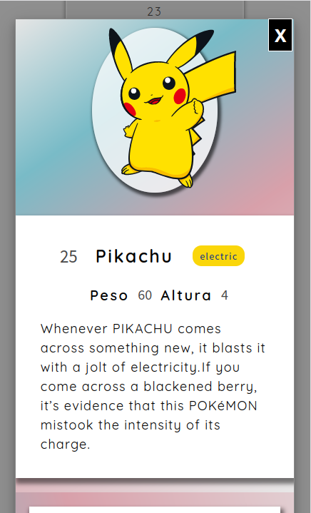
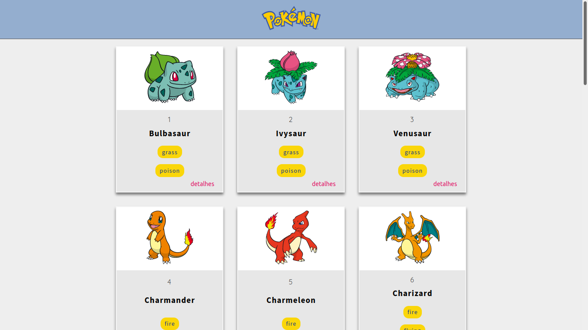

# Consumo de API Pokemon

Aplicativo web com paginação que consome dados da RestFul API para exibir detalhes de cada
pokemon ao usuário.

## Screenshots and Preview do Projeto

[Projeto Online](https://alessandradocouto.github.io/pokeApi-com-Javascript/)

## O que aprendemos ao desenvolver esse projeto

- Async/await

- Template Strings

- Acessar objetos com Destructuring

- Lógica de paginação de RestAPI 

- Uso de delegação de eventos para aplicação ficar performática

- Não usar ForEach com async / await

Não é adequado para promessas e não é adequado para espera assíncrona. 
Pois eu solicito cada url dos pokemons sem esperar pela resposta de
cada uma delas, os cards dos pokemons acabam ficando fora de ordem, 
porque as respostas chegam  em velocidade diferentes, sem ordem alguma.
    
- Tratamentos de erros de resposta JSON

Resposta(response) com valor null vindo da promise dá erro:

        Uncaught (in promise) SyntaxError: JSON.parse: unexpected character at 
        line 1 column 1 of the JSON data.

## Dados usados da PokeAPI

- 1118 Cards de Pokemons
- 807 espécies de Pokemon com fotos de alta qualidade
- Estatísticas
- Habilidades
- Tipo e Forma
- Grupos
- Habitat
- Evolution Chains

### Copyright

Este é um aplicativo não oficial, não comercial, feito apenas por mim e NÃO é afiliado ou apoiado pela Nintendo, Game Freak ou The Pokémon Company. 
Não tenho intenção de infringir direitos de autoria.

#### Gostou do projeto?

Deixe uma estrela ou caso queira melhora-lo pode dar **fork** e trabalhar no seu próprio projeto.